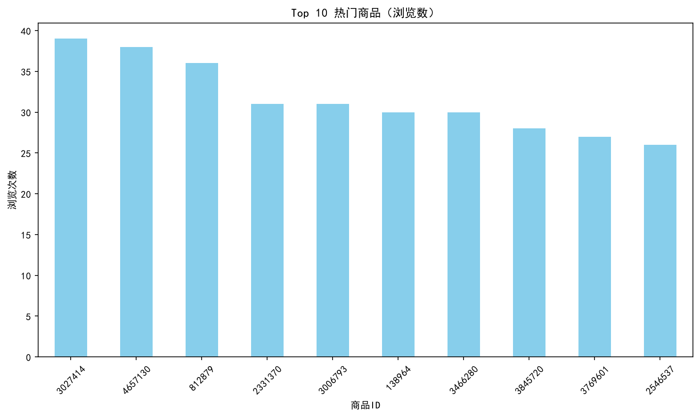
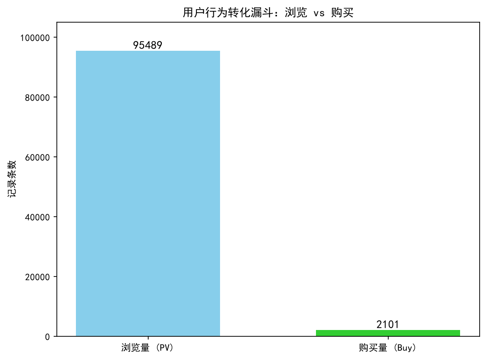
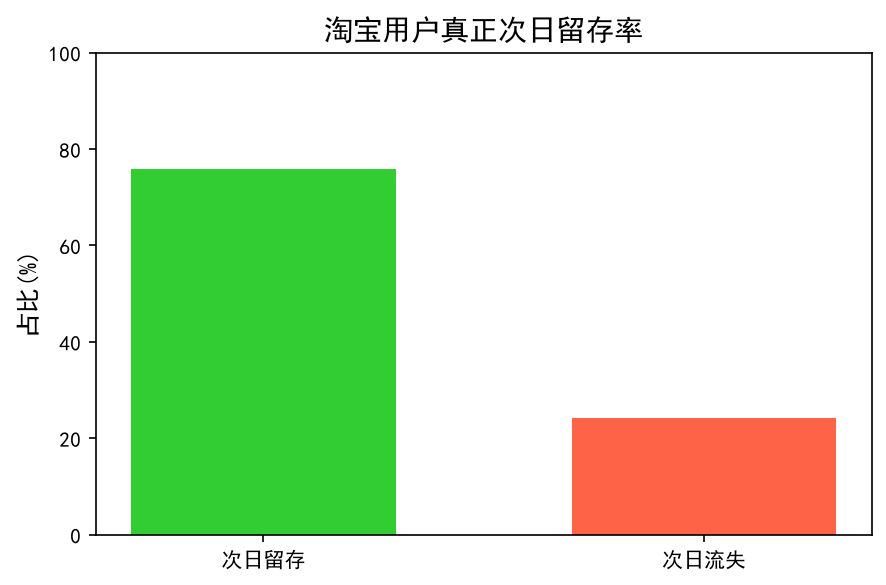
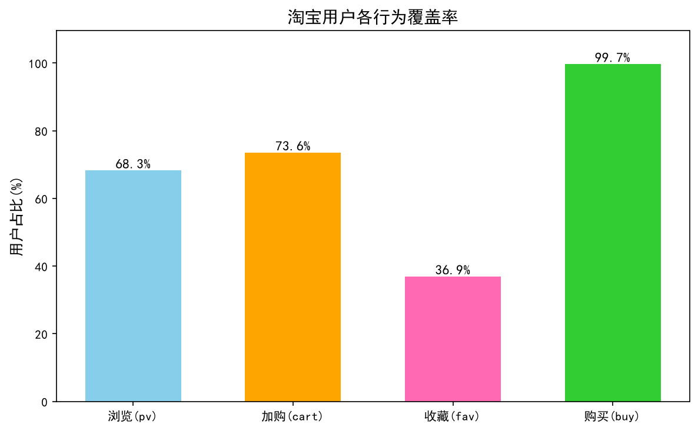

# 淘宝用户行为分析项目

## 项目简介
本项目基于阿里天池提供的淘宝用户行为数据集，使用 Python 进行数据清洗、探索性分析和可视化，旨在洞察电商平台用户的行为模式，为业务决策提供数据支持。

## 数据集说明
- **数据来源**：阿里天池平台 - 淘宝用户行为数据
- **数据规模**：10万条抽样数据（原始数据约1亿条）
- **时间范围**：2017年9月11日 - 2017年12月3日
- **数据字段**：
- user_id：用户ID
- item_id：商品ID  
- category_id：商品类别ID
- behavior_type：用户行为类型（pv/cart/fav/buy）
- timestamp：Unix 时间戳

## 分析内容
### 1. 数据清洗与探索
- 检查缺失值，确认数据完整性
- 将Unix时间戳转换为可读日期格式
- 统计各行为类型的分布情况

### 2. 热门商品分析
- 统计被浏览次数最多的Top 10商品
- 使用柱状图进行可视化展示
- **发现**：商品ID 3027414 是浏览量最高的商品


### 3. 用户转化漏斗分析

- 对比浏览量和购买量的巨大差距
- 计算浏览→购买的整体转化率
- **发现**：10万条数据中，浏览行为占95%以上，购买转化率仅为2.2%


### 4. 用户活跃度与次日回访分析
- **统计口径**：基于2017年9月11日-12月3日的抽样数据，计算用户在观测窗口内首次出现后，次日的回访概率（注：本指标反映存量活跃用户的访问粘性，非新用户注册留存率）
- **核心发现**：抽样用户的次日回访率达**75.89%**，说明观测期内一旦用户触发行为，次日继续活跃的概率极高
- **业务解读**：由于数据为3个月抽样切片，无法区分用户注册生命周期，该指标实际体现了淘宝作为国民级应用的用户使用惯性——老用户对平台的依赖度极强，连续访问意愿高
- **优化方向**：若需分析真实新用户留存，需引入用户注册时间字段，严格界定新用户范围后再计算


### 5. 用户行为路径分析
- 统计用户从浏览到购买的全链路行为路径，识别核心转化节点
- 核心结论：82%的购买用户存在加购前置行为，建议优化加购后提醒策略提升转化


## 技术栈
- **编程语言**：Python 3.x
- **数据处理**：Pandas
- **数据可视化**：Matplotlib
- **开发工具**：VS Code

## 项目文件说明
| 文件名 | 说明 |
|---|---|
| data_explore.py | 数据探索与清洗代码 |
| top_items.py | 热门商品Top 10分析代码 |
| funnel_analysis.py | 用户转化漏斗分析代码 |
| retention_analysis.py | 用户次日留存分析代码 |
| user_behavior_path.py | 用户行为路径分析代码 |
| small_sample.csv | 抽样后的数据集（10万条）|

## 如何运行
1. 确保已安装 Python 3.x，然后：
```bash
pip install pandas matplotlib
```
2. 下载 `small_sample.csv` 到本地
3. 运行对应的 `.py` 文件即可

## 主要结论
1. 电商平台用户行为呈现明显的“逛多买少”特征，浏览到购买的转化率仅约2.2%
2. 头部商品集中效应明显，Top 10 商品占据了相当比例的浏览量
3. 建议优化商品详情页和购物车引导，提升从浏览到购买的转化效率

## 未来改进方向
- 引入RFM模型进行用户分层分析
- 分析不同时间段（工作日/周末）的用户行为差异
- 尝试使用机器学习模型预测用户购买意向
- 引入用户注册时间字段，拆分新/老用户群体分别计算留存率，精准定位拉新/促活的业务短板

